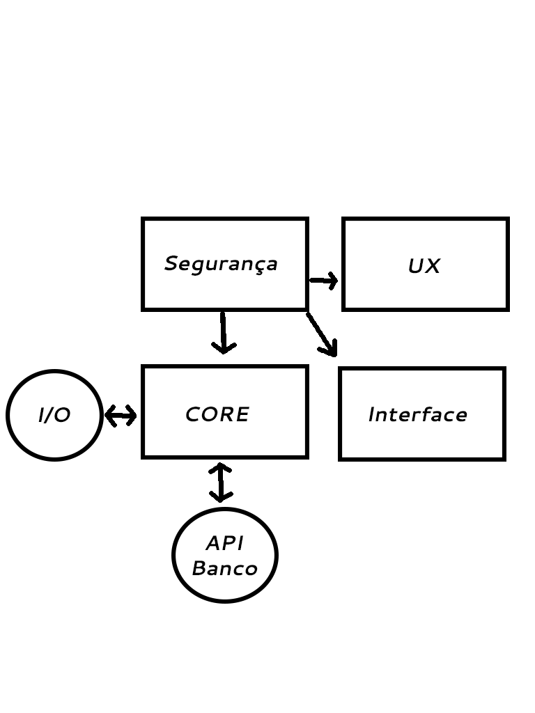

# Proposta para Software ATM
*Engenheiros do Javaí*

## Análise de Viabilidade

Segundo o hardware que temos a disposição descrito pelo cliente para realizar as operações mínimas, foi decidido que o desenvolvimento será dividido em 4 (quatro) times que trabalharão de forma modular, sendo eles: **segurança**, **user experience**, **core** e **interface**.

A equipe do **core** fornecerá as funcionalidades básicas, como a interpretação dos dados vindos do I/O e API do banco, para a equipe de **interface**, que através das diretivas da equipe de **UX**, construirá a interação de cliente com o banco. Todas as equipes serão supervisionadas pela equipe de **segurança**, que participará ativamente do processo de criação e desenvolvimento do software. 

Desta forma, concluímos que o desenvolvimento é possível dado a nossa disponibilidade de colaboradores.

## Requerimentos

- Drivers e suas documentações do hardware da ATM (Impressora, leitor de cartão, etc)
- API e suas documentações do Banco

## Design de Produto

Para a realização do **design do produto**, alocaremos uma equipe de **user experience (UX)** que será responsável por proporcionar ao usuário da máquina ATM o uso mais descomplicado, agradável e atrativo, desenvolvendo projetos que usem da diferenciação para produzir itens inovadores.

## Coding

A etapa de coding será desenvolvida pelas equipes de **core** e **interface**, onde **core** focará nas funcionalidades básicas de I/O e interação com o sistema do banco e **interface** focará na interação entre o cliente e máquina utilizando as APIs fornecidas pelo **core**. 

## Integração

O software será supervisionado pela equipe de **segurança**. Ao verificar possíveis falhas, poderão ser realizadas mudanças necessárias para não comprometer a confiabilidade do sistema.

A empresa contratada será responsavel pela correção de **bugs**, ou seja, itens fora do escopo acordado. Não se responsabiliza, no entanto, por defeitos causados pela API do banco nem pelo hardware disponibilizado.   

## Implementação

Inicialmente, a equipe de **UX** trabalhará construindo um protótipo de interaçãoentre o usuário e o sistema, que será implementado pelo grupo de **interface**. Em paralelo, a equipe de **core** desenvolverá as funcionalidades básicas necessárias para a integração. Posteriormente, a equipe de **interface** realizará a ponte entre o trabalho do **UX** e do **core**.

## Manutenção

Disponibilizaremos uma equipe de manutenção 24/7, além de um suporte técnico via telefone e manutenção remota em casos específicos.  
